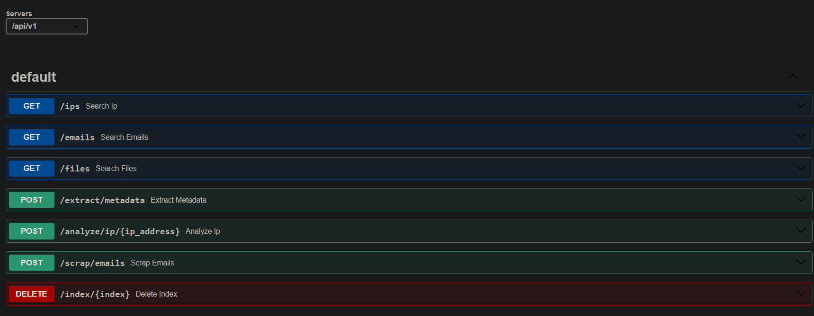

# ELASTIC OSINT API

## 1. Introduction

This project is a proof of concept for gathering information from open sources using **Elasticsearch**, **Kibana**, and **FastAPI**.


So far, the project has the following functionalities:

- Extracting metadata from a PDF file.
- Analyzing an IP address with Virus Total.
- Scraping web pages to obtain emails.
- Searching for collected artifacts.



## 2. Requirements
- Preferably Python > 3.12
- VirusTotal API Key
- Elasticsearch instance (Disabled for the demo in ./config/settings.conf)

## 3. Installation
Open a terminal and navigate to the project directory.
````
cd ./dev-elastic-osint-api
````

**Creation of the virtual environment**
````
python3 -m venv venv
````

**Activate the virtual environment**
````
.\venv\Scripts\activate
````

**Installation of dependencies**
````
pip3 install -r .\requirements.txt
````

**Run the Application**
````
./app.py
````

**Web Access**:
http://127.0.0.1:8000/docs

## 4. Unit Tests
Unit tests have been performed in the ./tests directory using pytest and pytest-asyncio.


